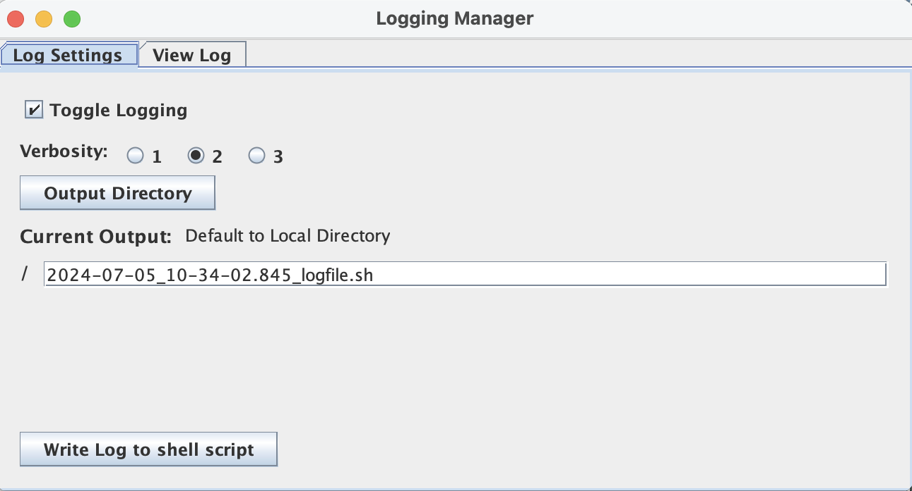
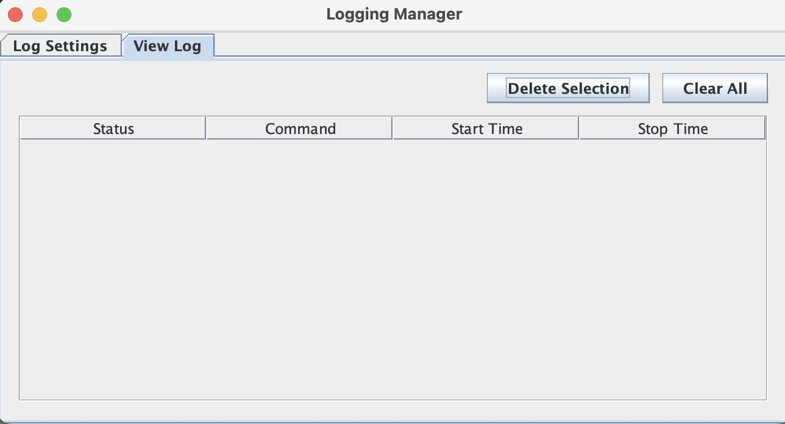

This guide introduces users to the new Log Manager tool in ScriptManager, which documents the process of analysis creation while using ScriptManager's bioinformatics tools. Upon opening the Log Manager window, users can access various features through the "Log Settings" and "View Log" tabs.

## Log Settings Tab

The Log Settings tab enables the user to customize the options for the Logging Manager function. 

 

* **Toggle Logging** feature allows the user to turn the logging feature on and off.
* **Verbosity** feature provides the user with different levels of information. 
    * "Level 1" - No comments; Command Provided
    * "Level 2" and "Level 3" - Run time information is provided; Command Provided 
* **Write Log to shell script** feature creates a shell script of the logfile into a provided 'Output 
    Directory'.

## View Log 
The View Log tab enables the user to access information on the building of their analysis. This helps the user keep track of the status, command line, and the run-time of their analysis.

 

* **Status** feature shows when the tool has completed building the analysis.         
* **Command** feature gives the user a shell script command line to build a specified analysis directly from their
    Terminal/Linux.  
* **Start Time** states when the analysis begins building. 
* **Stop Time** states when the analysis stops building. 
