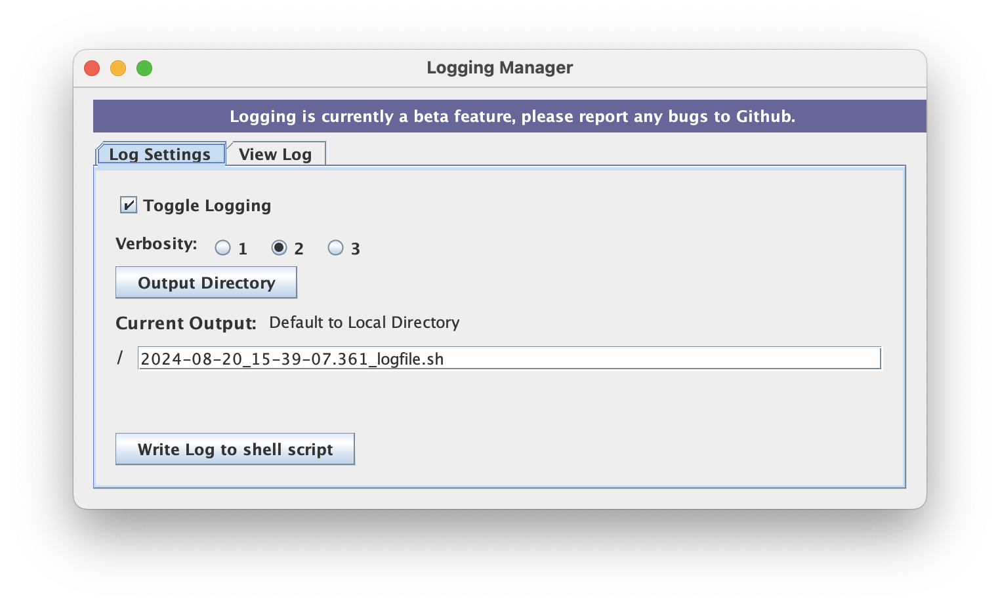
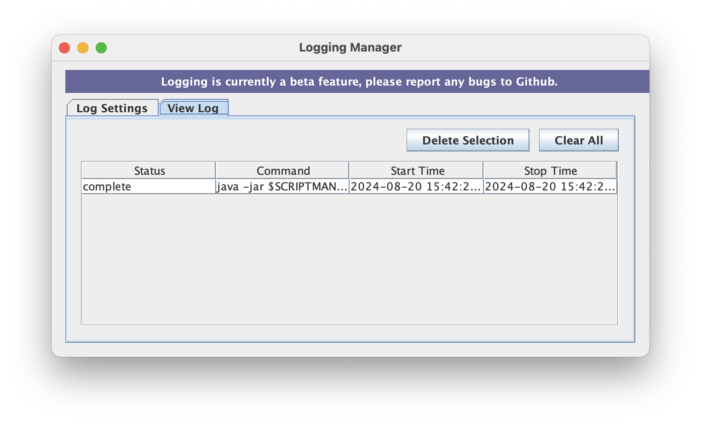

This guide introduces users to the new Log Manager tool in ScriptManager, which stores a record of a user's ScriptManager activity for a given session using the GUI.

  

Upon opening the Log Manager window, users can access various features through the "Log Settings" and "View Log" tabs.

## Log Settings Tab

The Log Settings tab allows the user to customize the options for the Logging Manager function.

* **Toggle Logging** feature allows the user to turn the logging feature on and off.
* **Verbosity** feature provides the user with different levels of information.
    * "Level 1" - No comments; Command Provided
    * "Level 2" and "Level 3" - Run time information is provided; Command Provided
* **Write Log to shell script** feature creates a shell script of the logfile into a provided 'Output Directory'.

## View Log 
The View Log tab enables the user to access information on the building of their analysis. This helps the user keep track of the status, command line, and the run-time of their analysis.

 

* **Status** indicates when the tool has started, finished, errored out of execution.
* **Command** stores the equivalent command line execution for each tool run.
* **Start Time** specifies when the analysis began.
* **Stop Time** specifies when the analysis finished/stopped.
