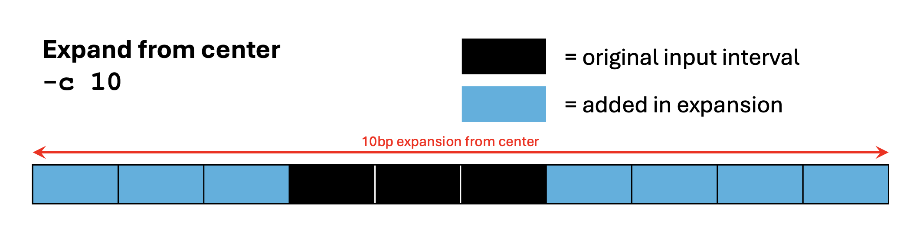
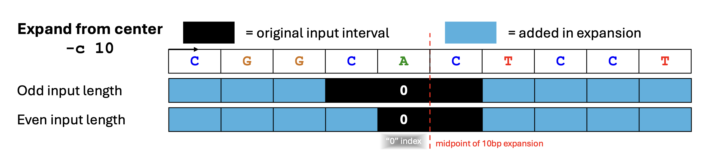
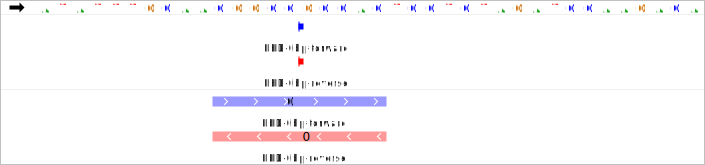
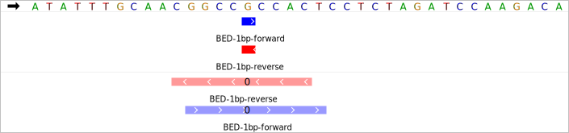
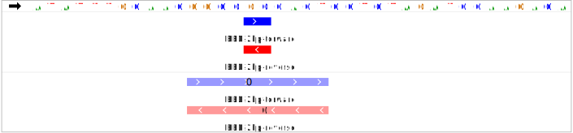
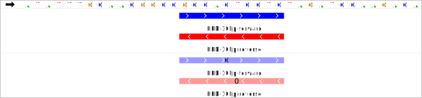

import InputFileBED from '/docs/DocComponents/InputFileBED.mdx'
import OutputGZip from '/docs/DocComponents/OutputGZip.mdx'

import Tabs from '@theme/Tabs';
import TabItem from '@theme/TabItem';


Expands input BED file by adding positions to the border or around the center.



This script is related to several [Bedtools functions][bedtools-slop] and is typically used to expand a set of peak annotations from the center to create a set of genomic intervals of fixed size. BED files with fixed interval lengths are useful for a variety of tools including ScriptManager's [Tag Pileup][tag-pileup] occupancy counts, [Extract FASTA sequence][fasta-extract] for [Four Color plots][four-color], and even for a number of other third-party analysis tools.

The script can also pad the intervals of BED coordinates to create intervals that aren't necessarily all of a fixed length.


<InputFileBED />


### Expansion strategy & size

Depending on the strategy selected, the "Size of Expansion" (in bp) can mean different things.

* __Expand from Center:__ The figure at the top of the page illustrates the "expand from center" expansion strategy where the midpoint is determined by script and then the window is expanded evenly on both sides of the midpoint to the size of expansion specified by the user. This results in a BED file with intervals of a fixed length.
* __Add to Border:__ This strategy pads both sides of the borders of the input intervals by a fixed amount specified by the user ("Size of Expansion"). Depending on whether or not the input BED file contains intervals of a fixed length, the resulting expansions will not necessarily include intervals of a fixed length.

<details>
    <summary>Exact bp details of center expansion</summary>

Note that an "expand from center" operation may be implemented a little differently across different tools because the "midpoint" of finite units (you can't split a nucleotide) can be determined by different conventions. Since all center expansions are expanded to even-lengthed windows, the midpoint is set to the position just-left of the midpoint.



ScriptManager also attempts to preserve the relative center in a strand-aware way. Below is a visualization in IGV of an example input set of input BED intervals and the output of a 10bp expansion from the center (`-c 10`). The figure was visualized in IGV and labeled with what ScriptManager (and [plotter][plotter-docs]) treats as the "0" position for the midpoint. Note that the "0" position in even-input expansions is always the "left" nucleotide of the center **relative to the strand orientation**.

View some examples by input length:

<Tabs>
  <TabItem value="0bp" label="0bp">

  </TabItem>
  <TabItem value="1bp" label="1bp" default>

  </TabItem>
  <TabItem value="2bp" label="2bp">

  </TabItem>
  <TabItem value="10bp" label="10bp">

  </TabItem>
</Tabs>

<!-- IGV Browser shot (10bp)-->


<!-- IGV Browser shot (2bp)-->
<!-- IGV Browser shot (1bp)-->

<!-- IGV Browser shot (0bp)-->


</details>

### Output format

For each input BED file, a new BED file is created with the original filename and a `*_<sizeofexpansion>bp.bed` suffix.

<!-- Consider adding an example input to output toy converter example -->

<OutputGZip />


## Command Line Interface

Usage:
```bash
java -jar ScriptManager.jar coordinate-manipulation expand-bed [-hsV] [-b=<border>]
[-c=<center>] [-o=<output>] <bedFile>
```

### Positional Input

This tool takes a single [BED file][bed-format] for input.


### Output Options

| Option | Description |
| ------ | ----------- |
| `-o, --output` | specify output filename (default name will be same as original with expansion info and `.bed` ext) |
| `-s, --stdout` | output gff to STDOUT |
| `-z, --gzip`            | gzip output (default=false) |

### Expansion Options

| Option | Description |
| ------ | ----------- |
| `-c, --center` | expand from center (default, at 250bp) |
| `-b, --border` | add to border |

[bedtools-slop]:https://bedtools.readthedocs.io/en/latest/content/tools/slop.html
[plotter-docs]:https://github.com/CEGRcode/plotter

[tag-pileup]:/docs/Tools/read-analysis/tag-pileup
[four-color]:/docs/Tools/figure-generation/four-color
[fasta-extract]:/docs/Tools/sequence-analysis/fasta-extract
